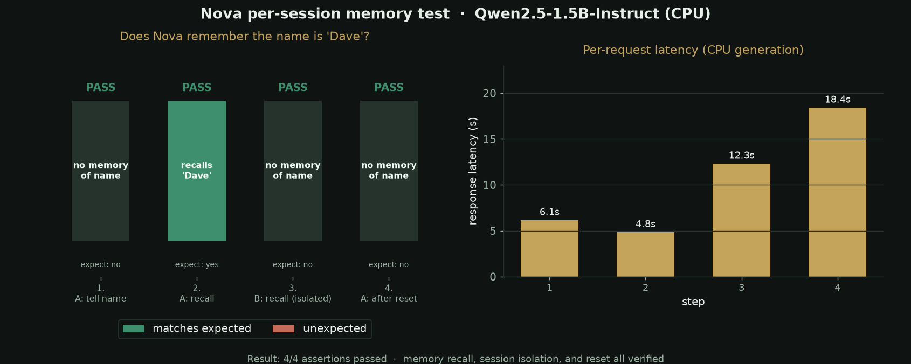

# Verification evidence

Evidence that the Cloud Agent environment fix and project hardening on branch
`cursor/fix-missing-install-sh-9e6d` work end to end.

## Per-session memory test

`serve.py` keeps chat history per browser session. The test below sends four
requests and confirms: session A recalls the name "Dave", session B is isolated,
and `/api/reset` clears A. Regenerate with `python scripts/plot_session_test.py`
after running the server (data comes from `/tmp/nova-test.jsonl`).



- `evidence/nova-session-test.png` — recall / isolation / reset all PASS, plus
  real per-request CPU latency.

## Environment build

- `evidence/branch-build-success.log` — tail of the successful draft environment
  build (waitress installed, `Qwen/Qwen2.5-1.5B-Instruct` prefetched, install
  exit 0, snapshot ready).
- `evidence/local-install-verification.log` — local `.cursor/install.sh` run and
  idempotent re-run.

## Automated tests

```
python -m pip install -r requirements-dev.txt
python -m pytest tests/
```
